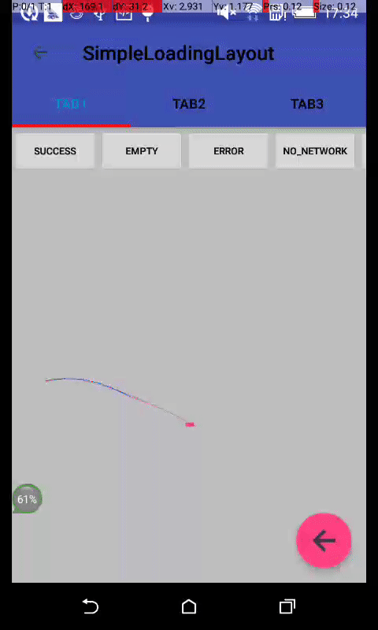

###  SimpleLoadingLayout 

[](https://github.com/hacket/SimpleLoadingLayout)

------

简单的页面多状态切换，支持`Empty`、`Error`、`NoNetwork`、`Requesting`、`Loading`及`Succeed`状态的切换




### Gradle

* 添加到根目录的build.gradle
```groovy
allprojects {
    repositories {
        jcenter()
        maven { url 'https://jitpack.io' }
    }
}
```

* 添加到dependencies
```groovy
dependencies {
    compile 'com.github.hacket:SimpleLoadingLayout:1.0.0'
}
```

### Usage

#### 支持全局配置，在Application初始化，应用到所有使用`SimpleLoadingLayout`：

```java
LoadingConfig.getInstance(this)
    .setEmptyText("暂无数据")
    .setNoNetworkText("网络出错, 请触屏幕重新加载")
    .setErrorText("服务器错误，稍后重试")
    .setLoadingViewLayout(R.layout.loading_layout_flower)
    .setNoNetworkImage(R.drawable.icon_home_error)
    .setErrorImage(R.drawable.icon_home_error);

```

#### 局部设置，仅对当前界面有效

* xml配置，支持`loadingView`、`emptyView`、`errorView`、`noNetworkView`配置
```xml
app:ll_empty_view="@layout/xxx"
app:ll_error_view="@layout/xxx"
app:ll_no_network_view="@layout/xxx"
app:ll_loading_view="@layout/xxx"
```

* Java代码配置
```java
mLoading.setLoadingViewLayout(R.layout.loading_layout_flower)
        .setEmptyText("暂无报告数据")
        .setErrorText("出错了")
        .setNoNetworkText("没有网络")
        .setErrorImage(R.mipmap.ic_launcher)
        .setErrorTextSize(18)
        .setReloadButtonText("点我重新加载");
```

#### 在xml中使用`SimpleLoadingLayout`
```xml
<me.hacket.library.loading.widget.SimpleLoadingLayout
        android:id="@+id/loading_layout"
        android:layout_width="match_parent"
        android:layout_height="match_parent">
    <android.support.v7.widget.RecyclerView
            android:id="@+id/rv_page"
            android:layout_width="match_parent"
            android:layout_height="match_parent">
    </android.support.v7.widget.RecyclerView>
</me.hacket.library.loading.widget.SimpleLoadingLayout>
```

**Note:** `SimpleLoadingLayout`只能添加一个子View

#### 第一次加载是否显示SucceedView
默认`ll_isFirstVisible`为false，所有状态的view都隐藏掉，界面会出现白屏；设置为true会默认加载显示succeedView。
```xml
app:ll_isFirstVisible="true"
```

#### 默认样式的errorView，noNetworkView支持`OnReloadListener`监听，有一个`@SimpleLoadingLayout.ReloadBtnType`注解支持区分
```java
mLoading.setOnReloadListener(new SimpleLoadingLayout.OnReloadListener() {
    @Override
    public void onReload(View v, @SimpleLoadingLayout.ReloadBtnType int reloadBtnType) {
        switch (reloadBtnType) {
            case SimpleLoadingLayout.ReloadBtnType.RELOAD_BTN_TYPE_ERROR:
                // TODO: 2016/12/22
                break;
            case SimpleLoadingLayout.ReloadBtnType.RELOAD_BTN_TYPE_NO_NETWORK:
                // TODO: 2016/12/22
                break;
            default:
                break;
        }
    }
});
```

#### 不同状态View的切换
```java
mLoading.onSucceed();
mLoading.onNoNetworkError();
mLoading.onEmpty();
mLoading.onError();
mLoading.onLoading();
mLoading.onRequesting();
```
**Note:**  `onRequesting()`和`onLoading()`区别是，Loading状态看不到succeed的View，Requesting状态可以看到succeed的View；`onLoading()`一般用于第一次加载数据用，`onRequesting()`用于界面有数据的时候发送请求用。

### Thanks

[LoadingLayoutDemo](https://github.com/weavey/LoadingLayoutDemo "https://github.com/weavey/LoadingLayoutDemo")

[MaterialPageStateLayout](https://github.com/Syehunter/MaterialPageStateLayout "https://github.com/Syehunter/MaterialPageStateLayout")

### License

```
Copyright 2016 hacket

Licensed under the Apache License, Version 2.0 (the "License");
you may not use this file except in compliance with the License.
You may obtain a copy of the License at

   http://www.apache.org/licenses/LICENSE-2.0

Unless required by applicable law or agreed to in writing, software
distributed under the License is distributed on an "AS IS" BASIS,
WITHOUT WARRANTIES OR CONDITIONS OF ANY KIND, either express or implied.
See the License for the specific language governing permissions and
limitations under the License.
```